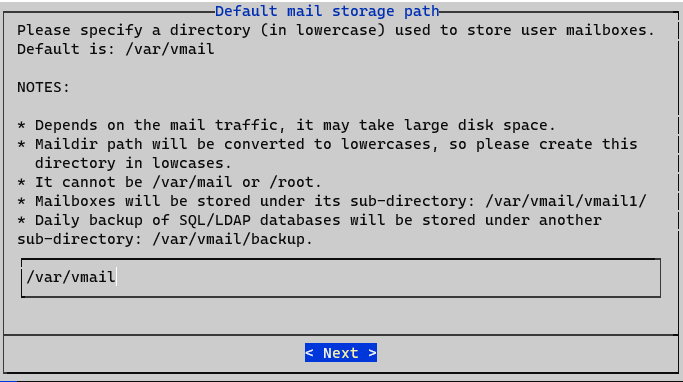
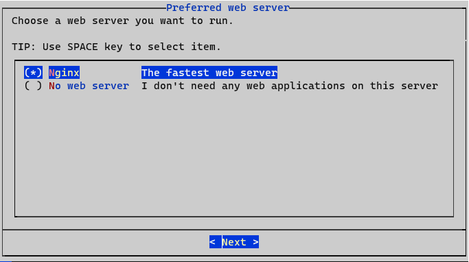
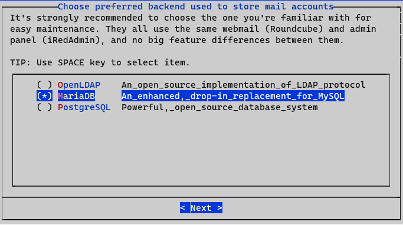
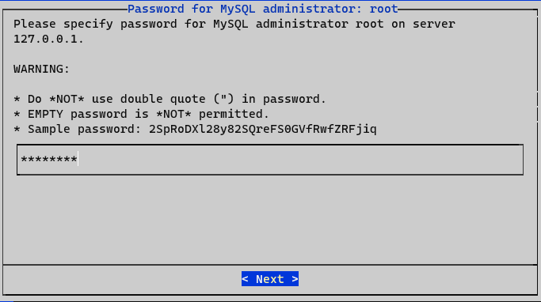
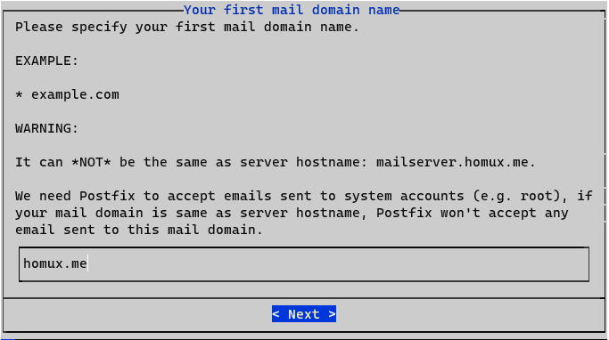
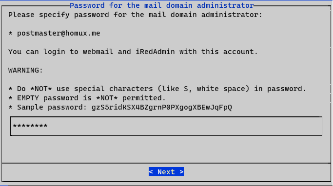
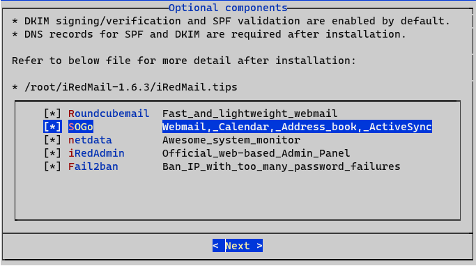

# iRedMail installation & configuration

🚨 La configuration ci-dessous permet de faire fonctionner `iRedMail` sur le *réseau local* **uniquement**

# Sommaire
- [Instalation](#instalation)
	- [Remarques](#remarques)
	- [Pre-requis](#pre-requis)
	- [1. Connexion à la nouvelle machine](#1-connexion-à-la-nouvelle-machine)
	- [2. Configurer une IP statique](#2-configurer-une-ip-statique)
	- [3. Adapter le hostname](#3-adapter-le-hostname)
	- [4. Mettre à jour le système](#4-mettre-à-jour-le-système)
	- [5. Installation de iRedMail](#5-installation-de-iredmail)
		- [Infos saisies](#infos-saisies)
		- [Services disponibles](#services-disponibles)
		- [Répertoire des mail](#répertoire-des-mail)
		- [Serveur web](#serveur-web)
		- [Base de données](#base-de-données)
		- [Domaine de mail](#domaine-de-mail)
		- [Mot de passe administrateur](#mot-de-passe-administrateur)
		- [Modules complémentaires](#modules-complémentaires)
		- [Recap avant installation](#recap-avant-installation)
		- [Installation (avec tous les modules)](#installation-avec-tous-les-modules)
		- [Utilisation du firewall de `IredMail`](#utilisation-du-firewall-de-iredmail)
		- [Récap](#récap)
	- [6. Redémarrage des services](#6-redémarrage-des-services)
- [Paramétrage DNS](#paramétrage-dns)
- [Overview](#overview)
	- [Roundcube webmail](#roundcube-webmail)
	- [SOGo](#sogo)
	- [netdata](#netdata)
	- [Web admin panel](#web-admin-panel)
- [Commandes utiles](#commandes-utiles)
	- [Postfix](#postfix)
		- [Afficher la liste des mails en attente d'envoi](#afficher-la-liste-des-mails-en-attente-denvoi)
		- [Envoyer les messages](#envoyer-les-messages)
		- [Supprimer les messages](#supprimer-les-messages)
	- [Debugguer postfix](#debugguer-postfix)
		- [Script - balayage de la pile d'emails](#script---balayage-de-la-pile-demails)
	- [Parcourir les logs de Nginx](#parcourir-les-logs-de-nginx)
	- [Vérifier les ports ouverts](#vérifier-les-ports-ouverts)
- [Scripts](#scripts)
	- [init-iredmail](#init-iredmail)
	- [init-swaks](#init-swaks)
- [MEMO](#memo)


# Instalation

## Remarques

les FAI bloquent par défaut le port 25 (utilisé pour la communication entre les serveurs de messagerie)
	> Port 25 doit être ouvert

Si distri choisie est un Ubuntu, prendre LTS


## Pre-requis
- [x] RAM : 4Go
- [ ] s'assurer que 3UID & GUID ne soit pas utiliser par un autre utilisateur/group (2000,2001,2002,...)
- [ ] Bien paramétrer les DNS : nom de domaine et IP doivent pointer vers la machine du server mail (MX, A, ...)

- [ ] 🚨 Adresse IP statique !
- [ ] machine accessible de l'extérieur (pour faire pointer ndd vers la machine)
- définir un nom de **`machine`** et un **`domaine`** qui match avec l'utilité du serveur :
  - la machine s'appelle `mail`
  - le domaine est `homux.me`
- configuration du fichier suivant le domaine : `10.10.200.221 webmail mail.homux.me`
  - `webmail` n'est pas obligatoire, il permet juste d'avoir un ndd local
  - `mail.homux.me` represente le serveur iRedMail


## 1. Connexion à la nouvelle machine
se connecter sur la machine en SSH, via root (`webmail` étant le nom associé dans le fichier `hosts` du client ssh)
```sh
ssh root@webmail
```
or via user, en passant ensuite en root
```sh
ssh user@webmail && su root
```


## 2. Configurer une IP statique
Pour configurer une IP *statique*
```sh
nano /etc/network/interfaces
```
Remplacer la ligne écrite par l'hyperviseur (VMWare, Proxmox, ...)
```
iface ens18 inet dhcp
```
par ce qui suit, en vérifiant que cette configuration match avec le réseau délivré par l'hyperviseur (l'IP ne doit pas être dans la plage du DHCP)
```
iface ens18 inet static
	address 10.10.200.231
	netmask 255.255.255.0
	gateway 10.10.200.254
```
Vérifier dans `/etc/resolv.conf`, que le nameserver correspond au gateway du réseau
> 
> ❌ Redémarrer le service réseau ne semblant pas fonctionner
> ```sh
> systemctl restart networking
> ```
> ✅ il est préférable de redémarrer la machine
> ```sh
> reboot
> ```
>


## 3. Adapter le hostname
```sh
hostname -f

# /etc/hostname
> mail.homux.me
```

Ensuite, editer le fichier `/etc/hosts` :
- commenter la ligne contenant `127.0.0.1`
- vérifier que la ligne `127.0.1.1` corresponde au schéma suivant :
```
[adresse ip locale] [hostname -f : nom de dommaine] [sous domaine : nom de la machine] localhost localhost.localdomain
```
suivant la **`machine`** et le **`domaine`** précédent :
```
127.0.1.1 mail.homux.me mail localhost localhost.localdomain
```


## 4. Mettre à jour le système
Avec ces réglages, la machine est prêt à tourner correctement avec le systeme **iRedMail**
```sh
apt update && apt upgrade && apt install gzip gnupg2 wget -y
```


## 5. Installation de iRedMail
Télécharger l'archive
```sh
wget https://github.com/iredmail/iRedMail/archive/refs/tags/1.6.3.tar.gz
```
récupérer le nom de l'archive avec un `ls`, puis la décompresser
```sh
tar zxf 1.6.3.tar.gz
```
se positionner dans le répertoire, et executer le fichier `iRedMail.sh`
```sh
cd iRedMail-1.6.3
bash iRedMail.sh
```

**condensé**
```sh
wget https://github.com/iredmail/iRedMail/archive/refs/tags/1.6.3.tar.gz && tar zxf 1.6.3.tar.gz && cd iRedMail-1.6.3 && bash iRedMail.sh
```

Suivre les écrans et les instructions.

**🚨 Ne pas oublier de redémarrer après installation 🚨**

### Infos saisies
- répertoire de stockage : /var/vmail
- MySQL password : password
- Nom de domaine : homux.me
- L'administrateur global : postmaster@homux.me / password

### Services disponibles
- Roundcube webmail : https://mail.homux.me/mail/
- SOGo groupware : https://mail.homux.me/SOGo/
- netdata (monitor) : https://mail.homux.me/netdata/
- Web admin panel (iRedAdmin): https://mail.homux.me/iredadmin/

### Répertoire des mail

### Serveur web

### Base de données


### Domaine de mail

### Mot de passe administrateur

### Modules complémentaires


### Recap avant installation
```
************************************************************************
******************************* WARNING ********************************
************************************************************************
*                                                                      *
* Below file contains sensitive infomation (username/password), please *
* do remember to *MOVE* it to a safe place after installation.         *
* /root/iRedMail-1.6.3/config                                          *
*                                                                      *

************************************************************************
************************* Review your settings *************************
************************************************************************

* Storage base directory:              /var/vmail
* Mailboxes:
* Daily backup of SQL/LDAP databases:
* Store mail accounts in:              MariaDB
* Web server:                          Nginx
* First mail domain name:              homux.me
* Mail domain admin:                   postmaster@homux.me
* Additional components:               Roundcubemail SOGo netdata iRedAdmin Fail2ban

< Question > Continue? [y | N]|Y
```
### Installation (avec tous les modules)
```
********************************************************************
* Start iRedMail Configurations
********************************************************************
[ INFO ] Generate self-signed SSL cert (4096 bits, expire in 10 years).
[ INFO ] Generate Diffie Hellman Group with openssl, please wait.
[ INFO ] Create required system accounts.
[ INFO ] Configure MariaDB database server.
[ INFO ] Setup daily cron job to backup SQL databases with /var/vmail/backup/backup_mysql.sh
[ INFO ] Configure Postfix (MTA).
[ INFO ] Configure Dovecot (POP3/IMAP/Managesieve/LMTP/LDA).
[ INFO ] Configure Nginx web server.
[ INFO ] Configure PHP.
[ INFO ] Configure mlmmj (mailing list manager).
[ INFO ] Configure ClamAV (anti-virus toolkit).
[ INFO ] Configure Amavisd-new (interface between MTA and content checkers).
[ INFO ] Configure SpamAssassin (content-based spam filter).
[ INFO ] Configure iRedAPD (postfix policy daemon).
[ INFO ] Configure iRedAdmin (official web-based admin panel).
[ INFO ] Configure Roundcube webmail.
[ INFO ] Configure SOGo Groupware (Webmail, Calendar, Address Book, ActiveSync).
[ INFO ] Configure Fail2ban (authentication failure monitor).
[ INFO ] Configure netdata (system and application monitor).

*************************************************************************
* iRedMail-1.6.3 installation and configuration complete.
*************************************************************************
```

### Utilisation du firewall de `IredMail`
```
< Question > Would you like to use firewall rules provided by iRedMail?
< Question > File: /etc/nftables.conf, with SSHD ports: 22. [Y|n]Y

[ INFO ] Copy firewall sample rules.

< Question > Restart firewall now (with ssh ports: 22)? [y|N]Y

[ INFO ] Restarting firewall ...
[ INFO ] Updating ClamAV database (freshclam), please wait ...
```

### Récap
**Services disponibles**
- Roundcube webmail : https://mail.homux.me/mail/
- SOGo groupware : https://mail.homux.me/SOGo/
- netdata (monitor) : https://mail.homux.me/netdata/
- Web admin panel (iRedAdmin): https://mail.homux.me/iredadmin/

```
********************************************************************
* URLs of installed web applications:
*
* - Roundcube webmail: https://mailserver.homux.me/mail/
* - SOGo groupware: https://mailserver.homux.me/SOGo/
* - netdata (monitor): https://mailserver.homux.me/netdata/
*
* - Web admin panel (iRedAdmin): https://mailserver.homux.me/iredadmin/
*
* You can login to above links with below credential:
*
* - Username: postmaster@homux.me
* - Password: password
*
*
********************************************************************
* Congratulations, mail server setup completed successfully. Please
* read below file for more information:
*
*   - /root/iRedMail-1.6.3/iRedMail.tips
*
* And it's sent to your mail account postmaster@homux.me.
*
********************* WARNING **************************************
*
* Please reboot your system to enable all mail services.
*
********************************************************************
```


## 6. Redémarrage des services
Avant de redémarrer, on sauvegarde la configuration
```sh
mv /root/iRedMail/config /root/iRedMail/config.bak
```
Pour sécuriser le fichier de configuration
```sh
gpg -c /root/iRedMail/config
```
enfin, on reboot
```sh
reboot
```

# Paramétrage DNS
- Supprimer les comptes POP et SMTP déjà présents.
- Supprimer tous les registres mx, pop ou smtp

**Zone DNS**

- Champ `MX` a créer dans le gestionnaire de nom de domaine :
	```
	MX mail.homux.me
	```

- Champs `A` a créer dans le gestionnaire de nom de domaine :
	```
	A mail.homux.me [adresse ip public]
	A pop.homux.me [adresse ip public]
	A smtp.homux.me [adresse ip public]
	```


# Overview
## Roundcube webmail
Roundcube est un client mail simple

**Accès** : https://mail.homux.me/mail/

## SOGo
SOgo est un client mail complet, contenant calendriers, ...

**Accès** : https://mail.homux.me/SOGo/

## netdata
System de monitoring

**Accès** : https://mail.homux.me/netdata/

## Web admin panel
Panneau d'administration de `iRedMail`

**Accès** : https://mail.homux.me/iredadmin/

# Commandes utiles

## Postfix
### Afficher la liste des mails en attente d'envoi
Lister les messages en cours d'envoi
```sh
mailq
```
Lister les messages différés
```sh
postqueue -p
```

### Envoyer les messages
```sh
postqueue -f
postfix flush
```
### Supprimer les messages
Pour supprimer les messages de la queue :
```sh
postsuper -d ALL
```
Pour supprimer tous les messages dans la queue des emails différés :
```sh
postsuper -d ALL deferred
```

## Debugguer postfix
```sh
# /etc/postfix.main.cf

# Ajouter la ligne suivante 
debug_peer_list = 10.10.200.231
```

Puis relancer postfix
```sh
postfix reload
```

### Script - balayage de la pile d'emails
```sh
#!/bin/bash
lid=""

while [ 1 = 1 ]; do
	res=`mailq | head -n 2 | tail -n 1`
	check=`echo $res | grep "Mail queue is empty"`
	if [ "e$check" == "e" ]; then
		id=`echo $res | cut -d' ' -f1`
		if [ "$lid" != "$id" ]; then
			postcat -q -beh $id
			lid=$id
		fi
	fi
done
```

## Parcourir les logs de Nginx
```sh
tail -f /var/log/nginx/access.log

tail -f /var/log/nginx/error.log
```
filtrer
```sh
cat /var/log/nginx/access.log | grep " 200 "
```

## Vérifier les ports ouverts
```sh
nc -zvw3 10.10.200.231 25
telnet 10.10.200.231 25
nmap 10.10.200.231 -p 25
```

# Scripts

## init-iredmail
Permet de préparer le système à l'installation de iRedMail, puis sauvegarde et chiffre le fichier de configuration.

🚩 L'automatisation des écrans n'est pas encore prise en compte

**usage**
```sh
bash iredmail-conf --verbose --silent
```

## init-swaks
Permet de configurer un client smtp sur une machine à partir des paramètres fournis

**Usage**
```sh
bash swaks-conf --smtp-port "587" --smtp-ip "10.10.200.231" --smtp-name "mail.homux.me" --username "postmaster@homux.me" --password "password"
```

**Paramètres**
```sh
--smtp-port   : SMTP port to use (25 or 587)
--smtp-ip     : IP of mail server
--smtp-name   : mail server associated domain name
--username   : username (email address) used to send messages
--password   : password used with username
```

# MEMO
test@homux.me / AjsFQ5T3X}

